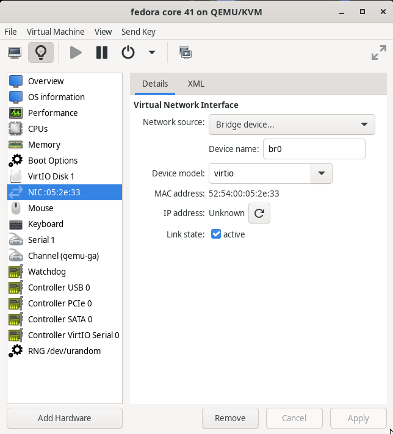
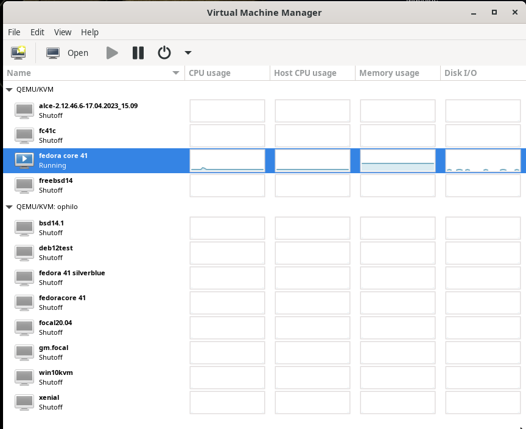

## правильное рабочее место девопс - персональное облако из KVM+libvirt

Популярная тема на youtube - Home Lab, домашняя сеть с кучей компьютерного и сетевого оборудования, часто в выделенном помещении, типа серверной. Вот один из самых известных блогеров на эту тему [Jeff Geerling youtuber, home lab](https://github.com/geerlingguy). Я умышленно здесь и далее буду приводить ссылку на гитхаб, где это возможно. Во-первых, репо на гитхабе, как правило, содержит все остальные ссылки - на youtube, в блог или сайт с документацией. Во-вторых, сразу виден код и авторитет разработчика, его звёзды, баджи, активность в проектах. Ну и конечно, у многих читателей есть профиль на гитхабе, можно отметить или форкнуть интересный проект.

Однако наша цель гораздо скромнее - мы будем строить на обычном ПК или ноутбуке персональное облако, используя, как видно из названия, KVM модуль из ядра Linux и набор утилит libvirt и qemu. Сразу определимся с минимальными требованиями к железу, чтобы попробовать руками всё обсуждаемое. Например, мой рабочий ноут - китайский Chuwi GemiBook Plus с процессором Intel N100, 4 ядра, 16GB памяти, nvme диск 960GB вполне справляется. Сразу объяснюсь за невольную рекламу дешёвых китайских ноутов - я не сразу выбрал этот 200 евро бук. У меня в домашней сети есть несколько SBC (single board computer) на arm64 и risc-V, опыт весьма интересный. Во-первых, Линукс на таких экзотических компьютерах сильно отличается от обычных ПК. Во-вторых, стал ценить не абстрактные BogoMIPS из dmesg, а реальный отклик в повседневной работе: веб, ютьюб, билды приложений. Неудобств нет, а TDP (thermal design power) 2-5W. Как и многие из вас, я беспокоюсь т.н. "углеродным следом", который оставляю. Нельзя сравнивать мой 10W N100 и процессор, который греется как утюг, но для глажки бесполезен, и даже наоборот, требует себя охлаждать, сначала мощными кулерами, а в жаркую погоду ещё и кондиционерами с весьма низким КПД. Короче, считаю, убедил - ваш компьютер справится с 2-3 виртуалками без проблем, на всякий случай проверьте, что аппаратная виртуализация поддерживается процессором:

```
lscpu | grep Virtualisation
Virtualisation:   VT-x
```

Установить связку KVM+libvirt можно во [многие дистрибутивы Linux](https://sysguides.com/install-kvm-on-linux). Не будем, однако, спешить, а выполним полезную подготовительную работу. Моя основная ОС уже много лет Ubuntu - удобный инсталятор, новые релизы каждые полгода, есть т.н. LTS(Long Term Support), кто предпочитаем стабильность. Есть ещё бесплатный на 5 машин [Ubuntu Pro](https://ubuntu.com/pro), с патчами безопасности в дополнительном репо. Но главная фича, из-за которой я не меняю дистрибутив - поддержка файловой системы ZFS. Вот о ней и поговорим.

ZFS - самая сложная из многочисленных ФС. Она является дефолтной во FreeBSD, и не только, дистрибутив Proxmox, про который мы обязательно поговорим, также по дефолту использует [OpenZFS](https://openzfs.github.io/openzfs-docs/Basic%20Concepts/index.html). Разница между Open и просто ZFS в лицензии. Оригинальная лицензия не была свободной, переписывание многих модулей и библиотек, чтобы эту ФС можно было включить в ядро Linux, заняло много лет. В Ubuntu, начиная c версии 20.04, уже можно выбрать ZFS как опцию при установке. Перечислю, кратко, что нам даёт ZFS:

1. Встроенное шифрование диска, не нужны никакие LUKS и танцы с бубном.
1. Модные контейнерные OverlayFS, виртульные диски формата QCOW2, используют COW(copy-on-write), ZFS это тоже умеет, так что можно сказать, она оптимизирована для контейнеров и ВМ. 
1. Замечательная фича - встроенный RAIDZ. В моём Proxmox сервере 8 портов SATA, мощный корпус со стойкой на 8 HD. Купил 7 штук одинаковых 4TB дисков, добавил в пул raidZ, в итоге 24TB довольно шустрого хранилища.
1. Можно забыть как кошмарный сон мучения с mdadm, lvm2 - партишены увеличиваются безо всякой суеты с PV/VG/LV. Впрочем, XFS это тоже умеет, поговорим позже и о ней.

Но это на будущее, виртуализация никак не привязана к файловой системе, можно использовать то что уже есть, в том числе и привычный дистрибутив. Буду рассказывать, однако, только об установке на Ubuntu, тема и так обширная, всё сразу не охватить.

По умолчанию libvirt создаёт внутреннюю сеть, на виртуальном устройстве в режиме nat. Для единственного хоста это не так важно, виртуалка будет доступна, но на будущее полезно настроить плоскую сеть, где виртуалка будет иметь свой ip адрес, как и физический хост. Для этого сделаем заранее на хостовой машине виртуальное устройство br0 и будем привязывать виртуалки к этому устройству. Cеть в обычном десктопном Ubuntu настраивается сервисом NetworkManager, через графический интерфейс, либо через его утилиту командной строки nmcli, либо через nmtui, с текстовым интерфейсом. Для серверных конфигураций документация рекомендует [netplan](https://documentation.ubuntu.com/server/explanation/networking/configuring-networks/#bridging-multiple-interfaces). В случае сервера необходимо хостовым машинам присваивать статические IP адреса, вплоть до того, что Proxmox, гораздо более мощный сервер виртуальных машин, с возможностью кластеризации, миграции ВМ, ceph и проч., отказался от NetworkManager и требует наличия ethernet порта. Мы же хотим сохранить удобство десктопной OS и добавить серверные возможности, поэтому будем использовать пакет [netplan.io](https://netplan.readthedocs.io/en/stable/howto/), который вполне совместим с NetworkManager. Вот пример конфигурации для хостовой машины, создающий на физическом ethernet устройстве виртуальный интерфейс br0:

```
sudo cat /etc/netplan/01-br0.yaml
network:
  version: 2
  renderer: networkd

  ethernets:
    eth0: # put your eth dev
      dhcp4: no
      dhcp6: true 
  bridges:
    br0:
      addresses: [192.168.100.201/24] # put your static IP
      interfaces:
      - eth0 # put your eth as above
      routes:
      - to: default
        via: 192.168.100.1            # put your gateway
        metric: 100
        on-link: true
      mtu: 1500
      nameservers:
        addresses: [192.168.100.1 86.57.253.204 8.8.8.8] # put your DNS servers
```

Создав файл /etc/netplan/01-br0.yaml, сначала проверим его корректность `sudo netplan try /etc/netplan/01-br0.yaml`, и, если `Configuration accepted`, применяем его `sudo netplan apply ...`. Посмотрим, что у нас с сетью. Должно быть что-то похожее на:

```
ip -c -br a|head -n 4
lo               UNKNOWN        127.0.0.1/8 ::1/128
enx50a1325241e5  UP
wlo1             DOWN
br0              UP             192.168.100.201/24
```

Во второй строке вывода стоит мой eth0, который является физическим интерфейсом, он активен(link state UP), но адреса не имеет. В последней строке мой br0, который является виртуальным интерфейсом с правильным статическим адресом. Более того, если мы посмотрим настройки с помощью `brctl` из пакета bridge-utils, то увидим что у нас появился полноценный бридж:

```
brctl show
bridge name	bridge id		        STP enabled	interfaces
br0		      8000.5ece13b49a21 	no  enx50a1325241e5
docker0	    8000.3eaa6a35c1e3	  no
```

Подготовка к установке KVM+libvirt завершена, возвращаемся к документу с сайта [https://sysguides.com/](https://sysguides.com/install-kvm-on-linux). Для Ubuntu это команда:

```
sudo apt install qemu-system-x86 libvirt-daemon-system virtinst \
    virt-manager virt-viewer ovmf swtpm qemu-utils guestfs-tools \
    libosinfo-bin tuned
```

На первых порах удобно прибегнуть к десктопному приложению virt-manager, позволяющее создавать, запускать, управлять виртуальными машинами. Под капотом прячутся много низкоуровневых утилит, рано или поздно придётся познакомиться и с libvirt-clients, и с qemu-utils, и с guestfs-tools.
Теперь можем попробовать создать первые виртуалки. Первым делом, как рекомендовано, добавим себя в группу libvirt, чтобы иметь возможность управлять виртуальными машинами, и настроим ACL на каталог, где хранятся образы виртуальных машин:

```
sudo usermod -aG libvirt $USER
sudo setfacl -R -b /var/lib/libvirt/images
sudo setfacl -R -m u:$USER:rwX /var/lib/libvirt/images
```

Самый простой и знакомый способ создания виртуальной машины — использовать iso-образ. Установка будет напоминать сотни раз пройденные шаги - скачать образ, указать путь к нему, задать имя виртуальной машины, количество оперативной памяти, выделить ядра процессора, и т.д. Расскажу чуть подробнее про пару новых опций для virt-manager. Во-первых, это использование настроенного ранее виртуального интерфеса br0. Во-вторых, формат виртуального диска QCOW2, посмотрим для примера настройки одной из моих виртуалок:

```
ls -lh /var/lib/libvirt/images/freebsd14.qcow2 
-rw-rw----+ 1 root root 11G Mar  2 12:00 /var/lib/libvirt/images/freebsd14.qcow2

du -BM /var/lib/libvirt/images/freebsd14.qcow2
5235M	/var/lib/libvirt/images/freebsd14.qcow2

qemu-img info /var/lib/libvirt/images/freebsd14.qcow2
image: /var/lib/libvirt/images/freebsd14.qcow2
file format: qcow2
virtual size: 10 GiB (10737418240 bytes)
disk size: 5.11 GiB
cluster_size: 65536
Format specific information:
    compat: 1.1
    compression type: zlib
    lazy refcounts: true
    refcount bits: 16
    corrupt: false
    extended l2: false
Child node '/file':
    filename: /var/lib/libvirt/images/freebsd14.qcow2
    protocol type: file
    file length: 10 GiB (10739318784 bytes)
    disk size: 5.11 GiB
```

Здесь показаны 4 размера: `ls -lh` видимый размер файла имиджа, `du -BM` занимаемое место на диске, `qemu-img info` выдаёт его внутренние параметры, в частности: `virtual size: 10 GiB` и реальный размер файла `disk size: 5.11 GiB`. Это возможности того самого COW(copy-on-write). Виртуальный размер - тот что мы указали при создании ВМ, а реальный размер файла - сколько фактически занято на диске. Внутри ВМ мы будем видеть эту разницу как свободное место, и оно также остаётся свободным на хостовой ФС. Мы можем заказывать размер диска с запасом, QCOW2 формат не займёт место пока оно не потребуется под данные внутри ВМ.

Тут бы надо приложить десяток картинок, но оставляю вам шанс догадаться самим, или поискать инструкцию с картинками. В итоге должно получиться что-то вроде этого:



virt-manager общий вид со списком ВМ на 2 хостах:



Десктопное приложение virt-manager не единственный способ создания ВМ. Можно, и иногда удобнее, использовать командную строку и соответствующие утилиты. Также можно установить ВМ из готового образа в формате для libvirt/qemu. Например, для [релиза 14.2 FreeBSD](https://download.freebsd.org/releases/VM-IMAGES/14.2-RELEASE/amd64/Latest/), всё, что заканчивается на .qcow2.xz, raw.xz - это образы для libvirt/qemu. После скачивания и распаковки выполним команду:

```
virt-install --name myvm --vcpus 1 --memory 2048 \
  --disk path=/var/lib/libvirt/images/myvm.qcow2,size=20 \
  --osinfo freebsd14.0 --network bridge=br0 \
  --graphics none --console pty,target_type=serial \
  --location http://mirror.yandex.ru/FreeBSD/releases/14.2-RELEASE/amd64/Latest/  
```

Предположим, вы успешно создали одну или несколько ВМ, проверили их в графическом режиме или настроили ключи для `ssh`. Настало время навести порядок с ДНС. У меня раздавал адреса и имена рутер от провайдера, он же и WiFi. Удобнее настроить на вашем основном компе, который включается первым и по умолчанию всегда доступен, сервис `dnsmasq`. Он умеет также dhcp, так что в одном конфиге сможем сразу задавать и IP адреса, и имена ВМ, вот часть моего конфига:

```
$ grep -v ^# /etc/dnsmasq.conf |sed '/^$/d'
server=/local/192.168.100.1
server=86.57.253.204
server=8.8.8.8
server=fe80::1
local=/local/
interface=br0
listen-address=192.168.100.201
domain=local
dhcp-hostsdir=/etc/dnsmasq.d
dhcp-range=192.168.100.100,192.168.100.254,24h
dhcp-host=52:54:00:cc:13:e4,192.168.100.101,fbsd14,infinite   # ophils freebsd14.2 
dhcp-host=52:54:00:1b:9a:72,192.168.100.110,fc41no,infinite   # ophilo fc41no
dhcp-host=02:00:00:01:1e:01,192.168.100.207,banana,infinite
dhcp-host=d8:3a:dd:e4:c5:a0,192.168.100.208,rpi5,infinite
dhcp-host=6c:cf:39:00:85:40,192.168.100.209,riscv,infinite
dhcp-option=1,255.255.255.0
dhcp-option=3,192.168.100.1
cache-size=5000
log-queries
log-dhcp
```

MAC адреса присваиваются в virt-manager, адреса до 100 оставил под WiFi, адреса с 201 - "железные" хосты, т.е. реальные устройства, диапазон от 100 до 200 виртуалки, со своими диапазонами для каждого хоста. Напомню, после каждой правки конфига сервис `dnsmasq` надо рестартовать.

На будущее, если ваше персональное облако продолжит расти, порекомендую китайский KVM свитч [4k hdmi usb kvm switch](https://aliexpress.ru/item/1005007906670242.html?sku_id=12000042791841633&spm=a2g2w.productlist.search_results.18.6a711cfeSjG1lb). KVM в данном случае keyboard video mouse переключатель, на это сокращение как нельзя кстати для нашей темы.

###            **[вернуться обратно в блог](index.md)**
