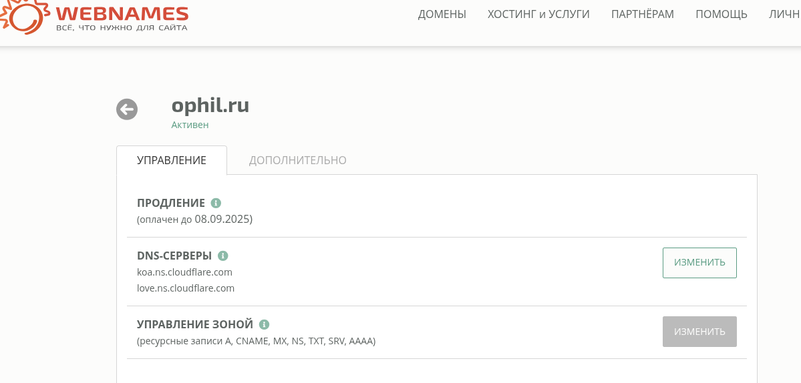
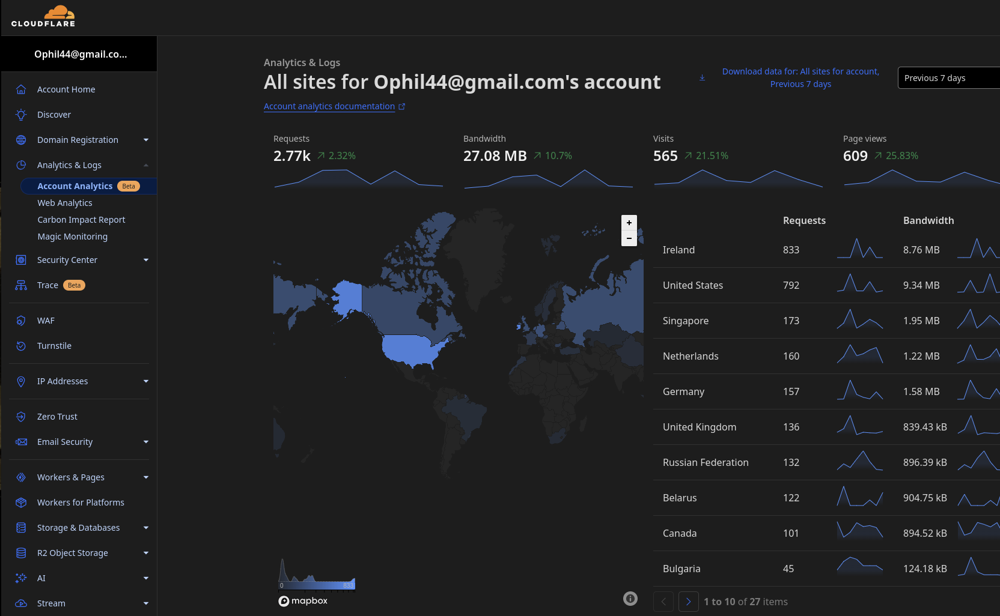

## знакомство с курсом девопс

Давайте вместе ответим и подробно обсудим один из самых популярных вопросов на собеседовании девопс: "подробно рассказать о всех событиях, когда пользователь набирает URL в адресной строке браузера и нажимает ввод". Для примера возьмём адрес [этой страницы](https://ophil.ru/blog/devops_intro.html) в моём блоге, потому что я довольно точно знаю как эта страница доставляется к вам на экран.

Воспользуемся для экономии печатания уже много раз рассказаным ответом на этот вопрос, и откроем, например, этот [how browser works](https://github.com/alex/what-happens-when). Гугл переводчик прекрасно работает, поэтому знание английского в данном случае не требуется. Также, для экономии, можно пропустить обработку нажатий клавиш, специфичную для разных устройств и систем, идём сразу на "Parse URL".

Как много всего происходит, а мы только добрались до функции gethostbyname. Тут я могу немного прояснить. Мой домен зарегистрирован у провайдера ДНС услуг , через личный кабинет можно управлять доменами и настройками ДНС. Одна из опций - указать другой ДНС сервер, у меня сейчас стоит ns.cloudflare.com. Зачем и почему, расскажу чуть позже. А пока идём дальше, через все детали ARP process, открытие сокета, согласование TLS, проверки сертификата, и, наконец, первые HTTP запросы.

В нашем документе рассказывается о сервере гугл. Эта страница хостится на сервисе github pages, и http-заголовки выглядят иначе. Подробнее об этом сервисе можно почитать в лабораторных работах в моём блоге [лаб. раб. 3](https://ophil.ru/blog/lab03.html). Реальный адрес сайта, если он хостится на гитхабе, выглядит так: https://ophilon.github.io/blog. Блог по прежнему доступен по этому адресу, и какое-то время переадресация на него стояла в настройках моего домена ophil.ru. Но для веб-страниц, а также для изображений, видео, скриптов, .css файлов, и прочей статики существует специальный сервис CDN(content delivery network). Он кэширует html-страницы и всё перечисленное на серверах по всему миру и размещённых как можно ближе к провайдеру и-нет услуг. Часто эти кэширующие сервера находятся прямо у провайдера, или в стране, откуда приходят основные пользователи. Я использовал [cloudflare](https://cloudflare.com), кроме кэширования, предоставляющего бесплатно, для небольших проектов, также , WAF. Всё это подробнее будем обсуждать по мере развития ваших проектов.

Идём дальше по документу [how browser works](https://github.com/alex/what-happens-when), что происходит в браузере после получения содержимого страницы, Browser High-Level Structure, HTML parsing, Document Object Model, вплоть до Page Rendering. В деталях это должны знать т.н. фронтэндеры, кто создаёт дизайн страниц и её активные элементы. Но иногда также и девопсам приходитя открывать отладчик в браузере, чтобы отследить какую либо неработающую метрику или потерянную картинку.

В задачи девопса входит не только понимание всех тонкостей работы современных веб-приложений, но и настройка всех сопутствующих сервисов, мониторинг, поиск и предупреждение ошибок, защита информации, и многое другое. Всё это надо обязательно попробовать руками в своём проекте. Предлагаю начать с самого простого, со статического сайта на [github pages](https://pages.github.com/). Девопс, как правило, работает в команде, которая создаёт сайт или веб-приложение, там могут быть специализации фронтэнд, бэкэнд, БД, аналитик/маркетолог, и проч. У нас такой команды нет. Но мы можем начать с простейшего статического сайта, разобраться, как гитхаб строит из markdown текста html страницы. Затем посмотреть, как это работает локально, в контейнере. Потом начать добавлять разные полезные сервисы, см. [лаб. раб. 6](https://ophil.ru/blog/lab06.html).

Далее можно попробовать собрать все сервисы на ВМ в облаке, добавить БД, собственный мониторинг, аналитику и т.д., вплоть до упаковки всего этого в контейнеры и разворачивании в кубер кластере. Т.е. ваш проект будет сквозным, через все темы курса.

По пути придётся освоить много разных языков и инструментов. В этот список наверняка войдут markdown, языки создания темплейтов ([liquid](https://github.com/Shopify/liquid), [Jinja2](https://github.com/pallets/jinja/)); файлы json, yaml, xml и умение их парсить всякими JSONPath, jq, yq; hcl для terraform, форматы Makefile, Dockerfile, манифестов k8s, конфигов nginx, systemd юнитов, и многого другого.

Понадобится писАть и отлаживать скрипты на shell, знать множество стандартных утилит Unix, уметь собирать бинарники, контейнеры или пакеты на многих языках программирования, и многое другое.Иначе вы не сможете понимать разрабов, программистов из вашей будущей команды.

Это долгий путь, путь девопс.

###            **[вернуться обратно в блог](index.md)**
