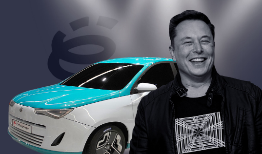

## Ё-мобиль vs Tesla, Прохоров против Маска

Сравнение может показаться не совсем корректным, действительно,
и подход, и условия, и результат этих проектов совершенно
различны. Разделены они также по времени старта. Но тем не менее,
оба проекта были попыткой создать революционный автомобиль и
основать с нуля новую автомобильную компанию. Задача крайне
амбициозная и, как правило, терпящая неудачу. Так что попробую
рассказать об истории этих проектов и провести некоторые
параллели.

Тесла проект стартовал в июле 2003 года, когда бизнес-партнеры
Мартин Эберхард и Марк Тарпеннинг основали компанию Tesla. Оба
были толковыми инженерами с небольшим предпринимательским
опытом. Они не изобретали ни новую электронику, ни новые
электромоторы - асинхронный двигатель изобрёл Никола Тесла
ещё в позапрошлом веке. Они придумали оригинальную бизнес
модель. Во-первых, автомобили уже давно используют множество
готовых деталей от сторонних производителей, их план состоял в
том, чтобы из готовых узлов собрать новый автомобиль на чистой
электрической энергии. Во-вторых, они нацелились на целевую
группу покупателей-гиков. Новые технологичные продукты,
несмотря на высокую стоимость при выходе на рынок, находят спрос
и в итоге создают массовый рынок. Так было с первыми смартфонами,
до этого с ноутбуками, с другими инновационными устройствами.

Идея замечательная, но денег для её реализации у партнёров не
было.  Автомобильные компании не хотели даже слушать подобную
ересь. Не далее как в 2002г. General Motors отозвала и пустила под пресс
свой электромобиль EV1, выпускавшийся 6 лет ограниченным тиражом:
<https://en.wikipedia.org/wiki/General_Motors_EV1>.
Остальные автогиганты также
считали технологию аккумуляторов для чистого электромобиля
недостаточно зрелой и надёжной на ближайшие годы, так что
основатели Тесла безуспешно искали инвестора вплоть до января
2004г., когда они рассказали о своём проекте Илону Маску.

Маск в тот момент был уже успешным предпринимателем и
инвестором, например, вывел на биржу компанию PayPal. Но Маск
был также амбициозным изобретателем и мечтателем. Его первой
собственной компанией стала SpaceX, основанная в мае 2002г. Идеи Маска
простирались гораздо дальше космических полётов и освоения
Марса. Маск мечтал также изменить многое на планете Земля,
для начала, например, изменить энергетический баланс страны и
избавить США от нефтяной зависимости. Идея основателей Тесла
нашла своего бизнес-ангела.

Дальнейшая история электромобиля Тесла похожа на
финансово-технологический триллер, где в равной степени
перемешаны отчаянные попытки найти деньги на разработку,
решить сложнейшие инженерные задачи, привлечь покупателей ещё
не созданных уникальных электрических суперкаров.

Первой моделью Тесла стал Roadster, на его разработку ушло более 2
лет. К маю 2006 штат сотрудников вырос до 100 человек, команда
наконец смогла показать публике EP1, или первый инженерный
прототип. Электродвигатель Тесла позволил разгонять машину с
места до 100 км/ч менее чем за 4 секунды, звёздная публика была в
восторге.  Маск сумел продать ещё не существовавших в тот момент
2600 машин при цене в 110 тыс. долларов. Даже с этими продажами денег
катастрофически не хватало.

Первый раунд инвестиций ещё в 2004г. составил 7.5 млн., из которых
лично Маск вложил 6.5. Второй раунд пришёлся на февраль 2006г. и
составил 13 млн. Сенсационный показ EP1 принёс ещё 40 млн и позволил
начать производство первых серийных машин.

Как и планировали основатели Тесла, сборку новых машин удалось
наладить с использованием имеющихся компонентов. Летом
2005 Tesla Motors подписала производственный контракт с
британской Group Lotus на производство «планеров» (полные автомобили без
трансмиссии). Сделать оставшуюся часть автомобиля оказалось
гораздо сложнее. Сроки поставки заказанных авто много раз
переносились, цена катастрофически росла, а в 2008г. грянул кризис.

Тесла была на грани выживания. Маску потребовалась
реорганизация компании, сокращение штата и расходов. Основатели
проекта были уволены, Маск привлёк новых кризис-менеджеров
чтобы спасти своё детище. В октябре 2008 Маск, до этого
главный инвестор и председатель совета директоров, занял пост
генерального директора и уволил четверть сотрудников Тесла. Компания
отчаянно искала деньги, в декабре пятый раунд инвестиций
превратился в долговое финансирование и добавил еще 40 млн,
избежав банкротства.  К январю 2009 Tesla заняла в итоге 187
млн. и поставила 147 автомобилей. Маск вложил в компанию 70 млн. из
собственных денег. 19 мая 2009г. немецкая Daimler AG, производитель
Mercedes-Benz, приобрела менее 10% акций Tesla за 50 миллионов.
По словам Маска, инвестиции Daimler спасли Tesla.

Как видим, создание новой автокомпании оказалось крайне
сложным делом. Пережив кризис и получив в июне 2009г. кредит
от Министерства энергетики США в размере 465 млн долларов США,
Тесла приобрела законсервированный автозавод Toyota во Фремонте,
Калифорния. Первую прибыль в размере 1 млн. при выручке в 20 млн
компания объявила за июль 2009г.

Кроме отчаянного поиска денег и технологических решений,
выживание Тесла было бы невозможно без маниакальной
увлечённости Маска идеей нового революционного
автомобиля. Многие, кто работал с Илоном, поделились
особенностями его стиля. Например, один из сотрудников
пропустил мероприятие, так как присутствовал при рождении
своего ребенка. Маск немедленно написал ему: «Это не повод. Я
весьма разочарован. Тебе необходимо расставить приоритеты. Мы
здесь меняем мир, меняем историю, и ты либо с нами, либо нет".
Вот рассказ Лайонса, инженера-механика, сотрудника под №12 при
старте проекта Тесла. Он возглавлял разработку нескольких ключевых
технологий Roadster, включая батарейный блок, мотор, силовую
электронику и трансмиссию. Лайонс не питал иллюзий
в отношении его характера, но с величайшим уважением относится к
визионерским и управленческим качествам Маска. «Работая в Tesla,
ты чувствовал себя полковником Курцем из «Апокалипсиса сегодня»,
— говорит Лайонс. — Не бойся применять безумные методы, просто
сделай работу. Это все от Илона. Он слушает, задает правильные
вопросы, быстр и способен докопаться до сути»

Вот и пришло время посмотреть на проект Ё-мобиля. О том, что
российский бизнесмен Михаил Прохоров собирается заниматься
выпуском автомобилей, стало известно в январе 2010. Было
анонсировано, что гибридные автомобили будут разрабатываться с
использованием самых передовых технологий, причем не западных,
а отечественных. История этого проекта изложена, например,
здесь: <https://motor.ru/stories/yoavto.htm>

Назвать гибридный автомобиль передовым рядом с уже гремевшей
по всему миру Теслой простительно только далёкому от техники
человеку. Ещё в нулевых читал мнение экспертов, что гибриды взяли
худшее из двух миров - от обычных ДВС получили все сложности
с топливной системой, трансмиссией, электрооборудованием,
охлаждением, и добавили к ним электромотор, ещё одну трансмиссию,
новые требования к аккумуляторам.

Справедливости ради, нашёл одно упоминание об удачном решении
гибридной компоновки - Hybrid Sinergy Drive от Тойоты. Инженеры
выбросили сцепление и коробку передач, а вместо них установили
обычный планетарный механизм. Он имеет три точки подключения крутящего
момента и может его распределять между этими точками. К
одной точке подключен бензиновый двигатель, соосно с ним
электрический мотор-генератор, ко второй электромотор,
к третьей собственно колёса. Компьютер управляет всеми
процессами, регулируя обороты двигателей, нагрузку на
мотор-генератор и плавно распределяя крутящие моменты.
Но это лишь исключение, которое подчёркивает правило.

В проекте М.Прохорова были ещё пара ошибочных, как теперь ясно,
идей - сделать машину дешёвой и сделать быстро, за 3 года. В шумихе
вокруг проекта упоминались также некий "роторно-лопастный
двигатель" и "суперконденсаторы" для накопления энергии. В этот
фантастический проект Прохоров готов был вложить 1 миллиард
евро!

Хронология Ё-мобиля в основном лишена технических деталей. Было
народное голосование о названии авто, проект получил своё имя
в конце 2010г. Были эскизы дизайна, модельного ряда, включающего
пятидверный хэтчбек, кроссовер и фургон. Прошла подписка на
будущий автомобиль в апреле 2011г., собраны заказы, как заявил
Прохоров, "на 10 лет вперёд".

Ё-мобиль ещё до создания получил огромную известность. Его,
точнее, макеты с неизвестной начинкой, возили по выставкам,
освещали как главную новость на ТВ. Строительство завода для
сборки ё-мобиля началось в индустриальном парке «Марьино»
в Санкт-Петербурге в июне 2011г. К концу 2012 стало ясно, что
сроки выпуска нового авто нереальны, надо ещё много времени
на создание работающего гибрида. Затем пришёл кризис 2014г.,
стало ясно, что цена ё-мобиля с учётом замены мифического
роторно-лопастного двигателя на обычный поршневой, к тому же
импортный, многократно превысит обещанную.

В октябре 2014 г. Прохоров и группа «ОНЭКСИМ» объявили о
прекращении проекта и передали техническую документацию
научному центру. За прошедшие с тех пор почти 7 лет
новости о каком-либо реальном использовании идей ё-мобиля
не появились. С другой стороны, Прохоров выполнил одно из
обещаний - его инвестиции остались в России. Выделенные деньги
успешно освоены, некоторые из причастных продолжают бизнес в
автоиндустрии.

Посмотрим теперь на причины провала ё-мобиля имея перед глазами
триумф Тесла.

Во-первых, гибрид оказался недостаточно революционным по
сравнению с чистым электро. Маск начал конкуренцию с гигантами
автоиндустрии на совершенно новом рынке, можно сказать, он его
создал.

Во-вторых, Тесла не собиралась делать электромобиль дешёвым,
наоборот, расчёт был на техно-гиков, готовых платить за новизну.
Маск, кстати, также надеется сделать в будущем электрокар
доступным. Это вполне реально, если посмотреть на стоимость
самого дорогого компонента всех моделей Тесла. Аккумуляторные
батареи в 2010г. стоили свыше 1100 USD в расчёте на Квт*час, к
настоящему моменту цена упала на 89%, до 137. На смену древним
элементам 18650, созданным Sony в 1991г., Тесла разработала
улучшенный с обозначением 2170, выпускаемый миллиардными тиражами
на собственных гигафабриках. Совсем недавно был представлен
новый дизайн аккумуляторов 4680, т.н. tabless. Маск считает,
что новая технология позволит снизить цену ещё на 56%.

В обоих случаях срок создания автомобиля с нуля оказался много
больше запланированного. А вот с инвестициями у проекта ё-мобиля
было гораздо проще. Илон Маск отчаянно боролся за жизнь Тесла,
убеждая инвесторов и тратя собственные деньги. В команде Прохорова,
насмотря на огромные финансы, не нашлось людей, способных
принять правильное стратегическое решение и проявить такое же,
как у Маска, стремление достичь цели.

Забываем про ё-мобиль, он более не интересен. А вот Тесла под
руководством Маска продолжает менять наш мир. Одновременно с
развёртыванием производства электрокаров, Тесла раскинула сеть
заправок по США, затем в Канаде, Европе. Долгое время зарядить
любую из моделей Tesla (S3XY) можно было бесплатно. Отработав
гарантийный срок, батарейки стали использовать в PowerWall,
домашнем резервном аккумуляторе энергии. Далее Маск развернул
производство SolarRoof, ещё одна инновация от Тесла. Крыша с
фотоэлементами удовольствие не дешёвое, но вырабатываемая
энергия совершенно чистая.

Маск, создавая электромобиль, превратил его в настоящий
компьютер. Каждая машина Тесла постоянно подключена к
центральному серверу, диагностика, обновления ПО доставляются
"по воздуху". Некоторые опции Теслы доступны в виде программ,
например, заплати несколько тысяч и можешь пользоваться
автопилотом. Или гоняй в симуляторе за рулём собственного
автомобиля, глядя в большой монитор, заменивший в Тесле
привычные приборы.

Спрос на электромобили был так высок, что купить новое
авто можно было только заказав заранее. У Тесла не было ни
автосалонов, ни сети дилеров, машины доставлялись напрямую
от завода к покупателю. Крупнейшие автоконцерны бросились
навёрстывать упущенное. Одна за другой компании с вековым
опытом в автостроении объявляют о прекращении выпуска машин с
ДВС в скором будущем. Мне почему-то кажется, что Тесла с Илоном
Маском ещё долго будет недосягаема.

###            **[вернуться обратно в блог](index.md)**
